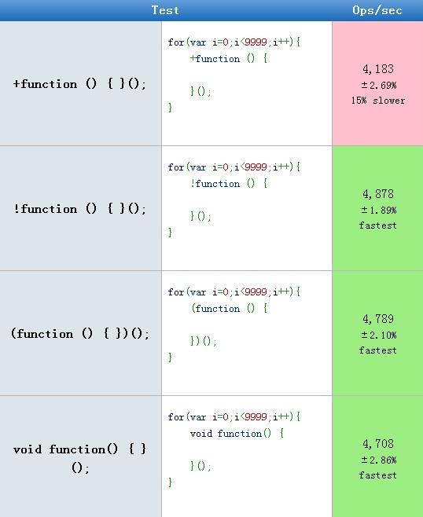

> 原文： http://blog.csdn.net/ebw123/article/details/42428451

## 什么是 `IIFE`

在Bootstrap源码和其他jQuery插件经常看到如下的写法： 

```js
+function ($) {   
  ...
}(window.jQuery);  
```

这种写法称为：	`IIFE（Imdiately Invoked Function Expression 立即执行的函数表达式）` 。

先弄清 `函数表达式（function expression）` 和 `函数声明（function declaration）` 的区别：

函数表达式  `Function Expression - var test = function() {}; `
函数申明    `Function Declaration - function test() {};`

函数表达式中的函数可以为匿名函数，也可以有函数名，但是该函数实际上不能直接使用，只能通过表达式左边的变量 a 来调用。 

```js
var a = function(){  
  console.log('Function expression');  
}  
var b = new a(); 
``` 

函数声明时必须有函数名。 

```
function a(){  
  console.log('Function declaration');  
}  
a();  
```

这是一个匿名函数。

```js
function () {  
  
}
```

你也许注意到匿名函数在console下会报错。console的执行和报错如下：

```
function(){}

SyntaxError: Unexpected token (
```

通过**一元操作符+变成了函数表达式**。也可以使用 `- ~ ！` 等其他一元运算符或者括号，目的是为了引导解析器，指明运算符附近是一个表达式。以下是三种经典方式 ：

```js
+function () {   
  
};  
  
(function () {  
  
});  
  
void function() {  
   
};  
```

函数表达式通过 末尾的() 来调用并运行。就是一个IIFE。

```js
+function () {   
  
}();  
  
(funtion () {  
  
})(); 
``` 

## 代码性能

运算符： `+加` `-减` `!逻辑非` `~位取反`，返回NaN(Not A Number)。

`()`组运算符： 返回表达式的执行结果undefined。

`void`： 按运算符结合语句执行，返回 undefined。

这几种的性能对比结果:  



可见 `+` 性能最差（在Firefox下差距更明显），其他几种都差不多。不过IIFE只执行一遍，对js执行效率的影响特别小，使用哪种还是看个人爱好。

传参，为了避免$与其他库或者模板申明冲突，window.jQuery 作为参数传递。

```js
+function (x) {  
    console.log(x);  
}(3);  
  
+function ($) {  
  
}(window.jQuery);  
``` 

## 使用IIFE的好处

总结有4点： `提升性能`、 `有利于压缩`、 `避免冲突`、 `依赖加载`

- 1、减少作用域查找。  

使用IIFE的一个微小的性能优势是通过匿名函数的参数传递常用全局对象window、document、jQuery，在作用域内引用这些全局对象。  
JavaScript解释器首先在作用域内查找属性，然后一直沿着链向上查找，直到全局范围。将全局对象放在IIFE作用域内提升js解释器的查找速度和性能。

传递全局对象到IIFE的一段代码示例：

```js
// Anonymous function that has three arguments  
function(window, document, $) {  
  
  // You can now reference the window, document, and jQuery objects in a local scope  
  
}(window, document, window.jQuery); // The global window, document, and jQuery objects are passed into the anonymous function  
```
 

- 2、有利于压缩。  

另一个微小的优势是有利于代码压缩。既然通过参数传递了这些全局对象，压缩的时候可以将这些全局对象匿名为一个字符的变量名（只要这个字符没有被其他变量使用过）。如果上面的代码压缩后会变成这样：

```js
// Anonymous function that has three arguments  
function(w, d, $) {  
  
  // You can now reference the window, document, and jQuery objects in a local scope  
  
}(window, document, window.jQuery); // The global window, document, and jQuery objects are passed into the anonymous function  
```
 
- 3、避免全局命名冲突。  

当使用jQuery的时候，全局的window.jQuery对象 作为一个参数传递给$，在匿名函数内部你再也不需要担心$和其他库或者模板申明冲突。 正如James padolsey所说: An IIFE protects a module’s scope from the environment in which it is placed.

- 4、通过传参的方式，可以灵活的加载第三方插件。（当然使用模块化加载更好，这里不考虑。）  

举个例子，如果a页面需要使用KindEditor， a.html引入kindeditor.js 和 a.js

你可能会这么写 a.js： 

```js
$(function() {  
  
   var editor  
    KindEditor.ready(function(K) {  
  
        editor = K.create('textarea[data-name="kindeditor"]', {  
            resizeType : 1  
        })  
    })  
   
})  
```

b页面不需要使用Kindeditor，没有引入kindeditor.js。但是在合并JS代码后，b页面也会执行a.js中的代码，页面报错Uncaught ReferenceError: KindEditor is not defined。  

也就是b页面执行了KindEditor，难道所有页面都要加载Kindeditor源文件？ 

可以这么修改a.js，将KindEditor变量参数化，通过给立即执行的函数表示式的参数赋值，那么其他页面都不需要加载Kindeditor源文件

```js
+function( KindEditor){  
 
   var editor  
   if(KindEditor){  
       KindEditor.ready(function(K) {  
 
           editor = K.create('textarea[data-name="kindeditor"]', {  
           resizeType : 1  
           })  
        })  
    }  
  
}(KindEditor || undefined)  
```

## IIFE最佳实践

反对使用IIFE的其中一个理由是可读性差，如果你有大量的JavaScript代码都在一段IIFE里，要是想查找IIFE传递的实际参数值，必须要滚动到代码最后。幸运的是，你可以使用一个更可读的模式：

```js
(function (library) {  
  
    // Calls the second IIFE and locally passes in the global jQuery, window, and document objects  
    library(window, document, window.jQuery);  
  
}  
  
// Locally scoped parameters   
(function (window, document, $) {  
   
 // Library code goes here  
   
})); 
``` 

这种IIFE模式清晰的展示了传递了哪些全局对象到你的IIFE中，不需要滚动到长文档的最后。

## jQuery优化

一段看上去写法有点像的代码。大部分项目用这段代码做作用域，这段代码会在DOM加载完成时初始化jQuery代码。

```js
$(function(){   
  
}); 
```  

这种写法等同于 

```js
$(document).ready(function(){  
  // 在DOM加载完成时初始化jQuery代码。  
}); 
``` 

区别于 

```js
$(window).load(function(){  
  // 在图片等媒体文件加载完成时，初始化jQuery代码。  
});  
```
    
结合IIFE的最佳实践，更好的写法是，立即执行document ready

```js
+function ($) {  
  
  $(function(){  
  
  })  
  
}(window.jQuery) 
``` 

最佳实践

```js
// IIFE - Immediately Invoked Function Expression  
  +function(yourcode) {  
  
    // The global jQuery object is passed as a parameter  
    yourcode(window.jQuery, window, document);  
  
  }(function($, window, document) {  
  
    // The $ is now locally scoped   
   
    // Listen for the jQuery ready event on the document  
    $(function() {  
   
      // The DOM is ready!  
   
}));  
```
